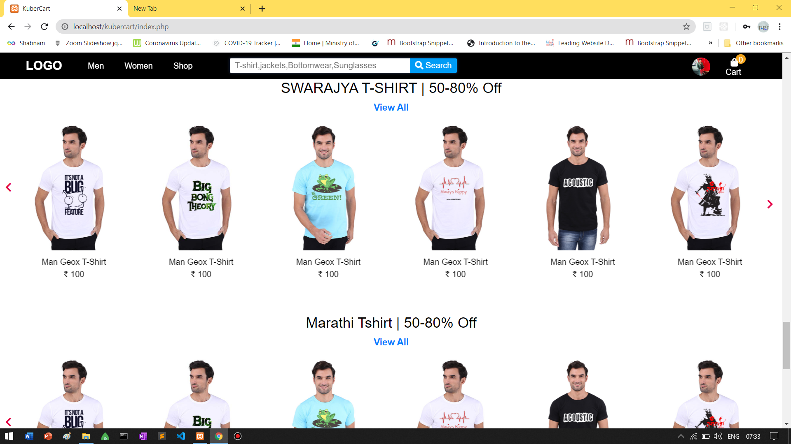
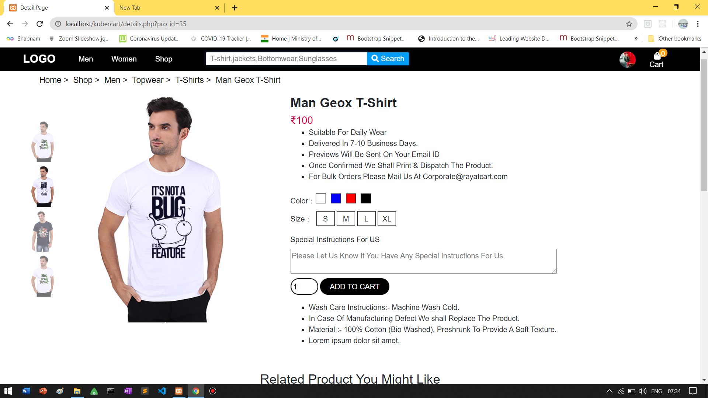
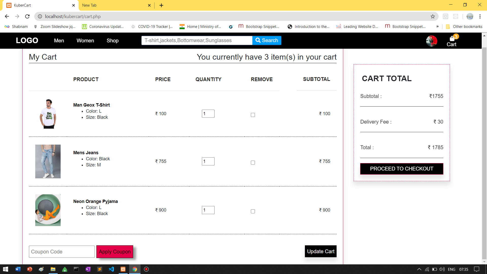
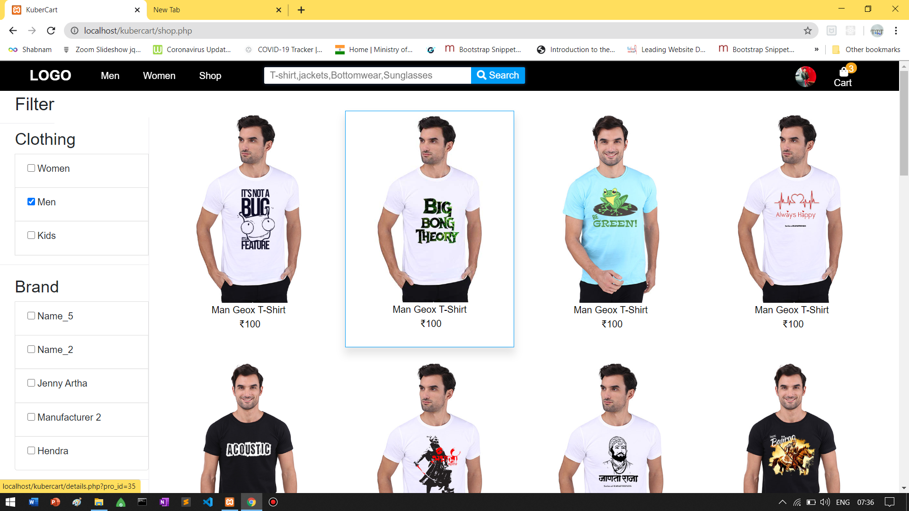
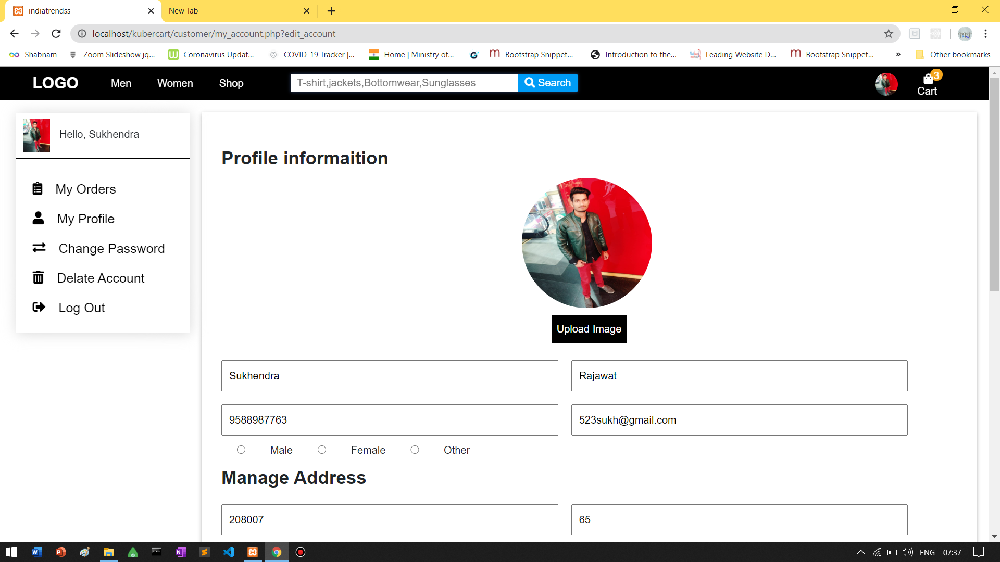

# Custom E-commerce website
## Description :-
Custom E-commerce website is a online store of Customised products
>On this website user can customize and
personalised their products they wants to buy
> user can design their T-shirt, Accessories etc.
by adding their Name, Photo, stickers and text
### Website LINK :- [Kubercart](http://kubercart.com/)

## Project Include :-
> Admin panel for store owner
> Customer Dashboard
> Payment gateway for online payments
> Cart functionality
> Order Management
> Payment Management
> Coupon Management
> Fully Dynamic Website
> Fully Responsive Website

## My Role : - Project Manager, Banked Developer

.
Duration : 20 days
Team Size :- 3
Technologies :- PHP SQL JavaScript HTML CSS

## Responsibilities :-

• Developed backend of website
• Project Management
• testing and quality analyst
• database design
